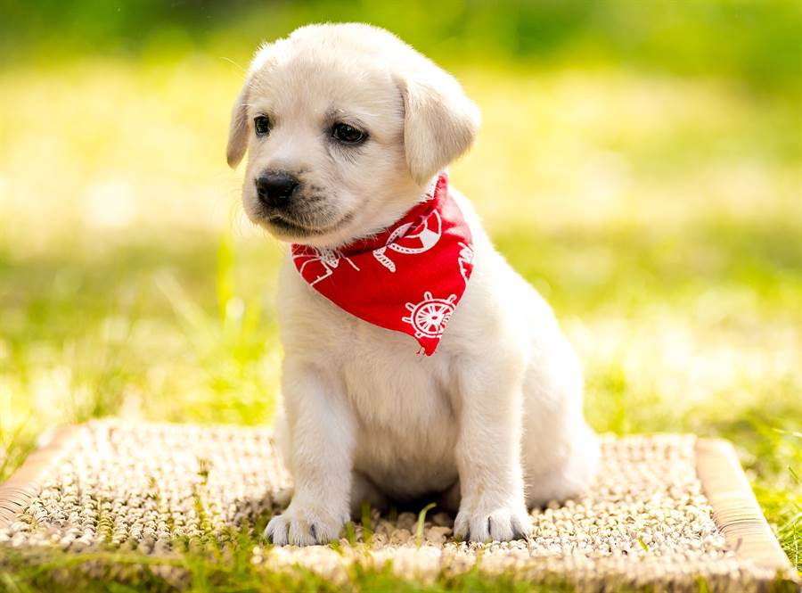

# yolo v1
## 项目目录
```text
｜--checkpoints          日志和权重
    |--log.txt              -日志
    |--best.pth             -权重
｜--datasets             数据集
    |--images.txt           -标签（总的，使用这个就可以了）
    |--voc2007.txt          -2007标签
    |--voc2012.txt          -2012标签
    |--voc2007test.txt      -2007test标签
    |--images/              -数据图片
        |--XXXX.jpg
        |--...
｜--imgs                 测试图片
    |--dog.jpg
    |--person.jpg
｜--models               模型
    |--resnet_yolo.py       -resnet模型
    |--vgg_yolo.py          -vgg模型
    |--yoloLoss.py          -损失函数
｜--utils                工具
    |--dataset.py           -数据集读取
    |--piplist2equal.py     -将requirements改成==形式（无用）
    |--xml2txt.py           -将标签从xml格式转成txt格式
｜--train.py             训练代码
｜--predict.py           预测代码
｜--eval_voc.py          计算mAP代码
｜--requirements.txt     环境


```

## 1. 环境准备
详细内容参考[requirements.txt](requirements.txt)

## 2. 数据集准备
**下载数据集**   
链接: https://pan.baidu.com/s/1hturxvztlt_ePnZt3TTzWQ  密码: 6qgn  

**解压数据集**   
1、将voc2007和voc2012的所有图片放到`datasets/images`目录下。  

2、然后使用`utils/xml2txt.py`将xml文件转成txt格式. （PS：此步骤可省略）。

## 3.训练
```shell
python train.py
```
## 4.预测
```text
python predict.py
```
## 5.计算mAP
```text
python eval_voc.py
```



## 参考
* 原项目地址:[https://github.com/xiongzihua/pytorch-YOLO-v1](https://github.com/xiongzihua/pytorch-YOLO-v1)